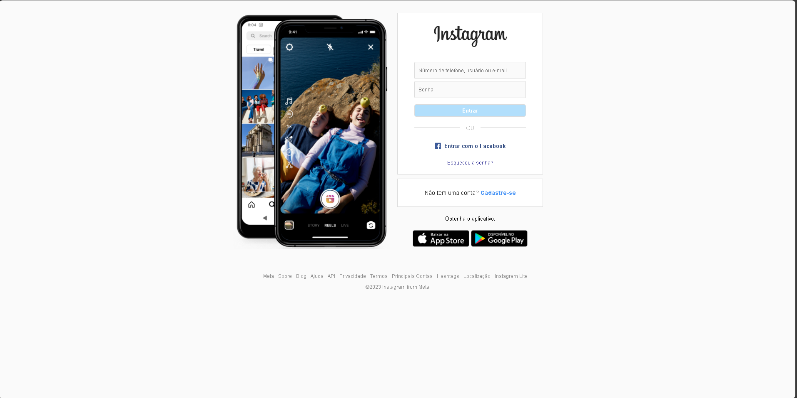

# clone-home-instagram
Clone da página inicial de login do Instagram.

Tecnologias e funcionalidades utilizadas: 
- HTML
- CSS
- Flexbox e Media queries para responsividade em dispositivos mobile

  

  

Confira o resultado final <a href="https://ma7euspinheiro.github.io/clone-home-instagram/">clicando aqui</a>

